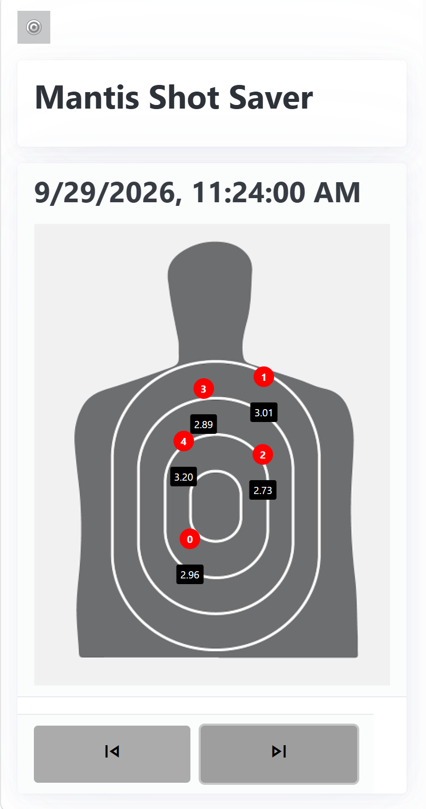

# Mantis Shot Saver

Simple utility to backup your Mantis Laser Academy data

## Configuration

* Copy `backend/sample.env` to `backend/.env`
* populate the variables with your mongodb cluster (such as an Atlas cluster, an M0 is fine)
* Populate the baseURL with your username from laser academy - you can get this by logging into Laser Academy, right clicking and and inspecting, pulling up the network tab, and trying to export a shots CSV file. You will see your URL in the network transfer. Do not include any URL parameters like the date etc. Also note your profile must be public. Presumably this is your username that you log in with, however if you log in with email I do not know what happens
* Deploy the docker container
* The cron job will run daily to pull yesterday's data. 
* If you want to do a one time pull of a year's worth of data, navigate to the `/api/importShotsAll` URL endpoint to pull in all the data one time

## Tech Stack

PicoCSS, FastAPI, AlpineJS, MongoDB

## Screenshots

